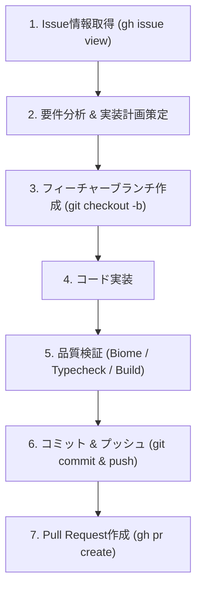

# Issue to Pull Request ワークフローマニュアル

GitHub Issueの要件を正確に把握し、高品質なコード変更を安全にPull Requestとして提出するための自動化手順です。

---

## 1. ワークフロー概要



---

## 2. 実行手順

### Step 1: Issue情報の取得
GitHub CLI (`gh`) を使用して、指定されたIssueのタイトル・本文・ラベルを取得します。

```bash
# Issue情報の取得
gh issue view <ISSUE_NUMBER> --json number,title,body,labels,assignees
```

取得した本文から以下を整理します：
- 解決すべき課題・機能要望
- 受け入れ基準（Acceptance Criteria）
- 影響を受けるコンポーネント

---

### Step 2: ブランチ作成
最新のメインブランチから、命名規約に沿ったトピックブランチを作成します。

```bash
# 最新のベースブランチを取り込む
git checkout main
git pull origin main

# ブランチを作成 (例: feature/issue-12-task-filter, fix/issue-34-ocr-bug)
git checkout -b feature/issue-<ISSUE_NUMBER>-<short-description>
```

---

### Step 3: 実装とコード変更
- [AGENTS.md](file:///Users/riku/Documents/childcare-task-agent/AGENTS.md) および [CLAUDE.md](file:///Users/riku/Documents/childcare-task-agent/CLAUDE.md) に記載された規約を遵守します。
- 破壊的変更を避け、既存のテストやフォールバックストアとの整合性を保ちます。

---

### Step 4: 品質検証 (必須)
コミット前に必ず以下のチェックをすべてパスさせます：

```bash
# 1. Linter & フォーマッター検証 (Biome)
npm run lint

# 2. TypeScript型チェック
npm run typecheck

# 3. ビルド検証
npm run build
```

問題がある場合は修正し、警告・エラーが解消されるまで繰り返します。

---

### Step 5: コミット & リモートプッシュ
変更内容をコミットし、リモートリポジトリにプッシュします。

```bash
git add .
git commit -m "feat: <簡潔な実装内容> (closes #<ISSUE_NUMBER>)"
git push -u origin feature/issue-<ISSUE_NUMBER>-<short-description>
```

---

### Step 6: Pull Request (PR) の作成
IssueとリンクしたPull Requestを作成します。

```bash
gh pr create \
  --title "feat: <タイトル> (#<ISSUE_NUMBER>)" \
  --body "## 概要
Issue #<ISSUE_NUMBER> の対応です。

## 変更内容
- <変更点1>
- <変更点2>

## 検証内容
- [x] npm run lint (Biome) 通過
- [x] npm run typecheck 通過
- [x] npm run build 通過

Closes #<ISSUE_NUMBER>
" \
  --base main
```

PR作成後、生成されたPR URLをユーザーに報告します。
